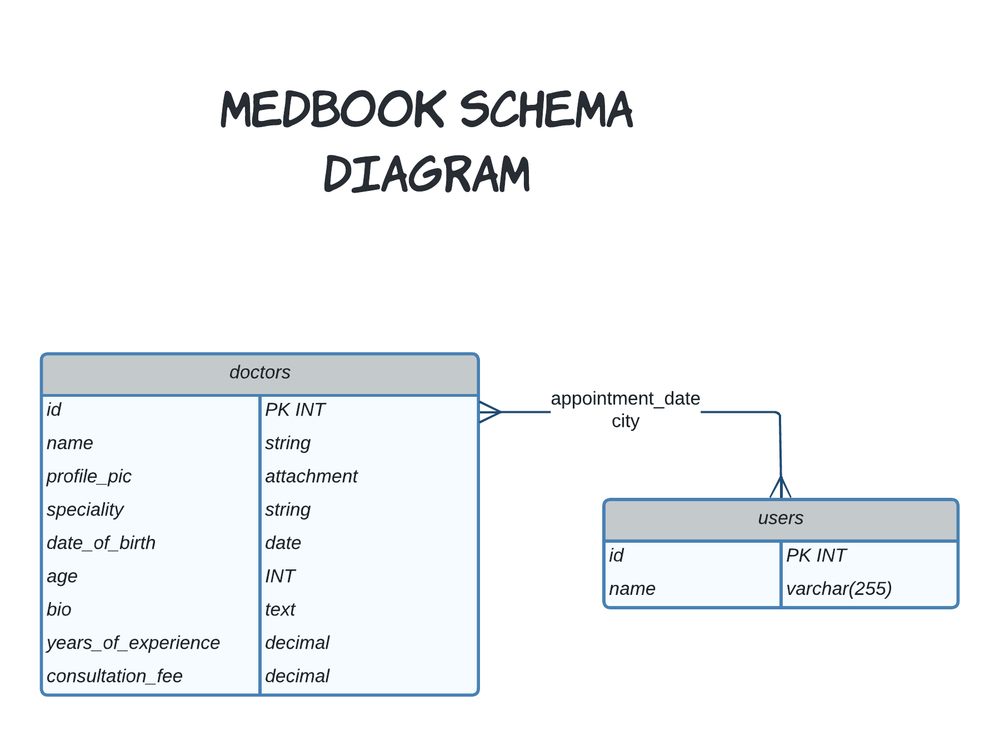

# Medbook-api

> ROR app to book doctor appointments.

Medbook-api is an app built with Ruby on Rails using the MVC architecture. The app allows users to book an appointment with any doctor they'd like.

## Schema diagram

## API-documentation

[medbook-api](https://Medbook-api.herokuapp.com/)

## Built With

- Major languages: Ruby
- Frameworks: ROR
- Gems: RSpec

## Getting Started

To get a local copy up and running follow these simple example steps.

### Prerequisites

You need to have followings installed in your local machine:

- `Ruby`
- `Postgresql`
- `Rails`
- `RSpec`
- `node.js`

### Setup

To setup the Items Library project in your local, in the repo page:

- click on code (dropdown list) > Download as ZIP.
- or open terminal of path you want to install project and run this command:
  `git clone git@github.com:codepantherr/medbook-api-tracker.git`
- `cd medbook-api-tracker/`
- `bundle install`
- `bin/rails db:create`
- `bin/rails db:migrate`

## Instruction on the usage

- Run the following comands in your command line:
- `rails s`
- `open any chrome/firefox`
- `type "localhost:3000"`
- `enjoy the app`

## Tests

- To run tests for current app, please run below commands in your terminal:
- `cd medbook-api/`
- `rspec spec spec/test_file_name`

## Authors 👤

👤 **Amr Ahmed**

- GitHub: [@Amrhub](https://github.com/Amrhub/)
- LinkedIn: [Amr Ahmed](https://www.linkedin.com/in/amr-abdelrehim-ahmed/)

👤 **Michael Oladele**

- GitHub: [@micheaol](https://github.com/micheaol)
- Twitter: [@micheaol](https://twitter.com/micheaol)
- LinkedIn: [@micheaol](https://www.linkedin.com/in/micheaol/)

👤 **Alejandro Ramos**

- GitHub: [@AlexRS90](https://github.com/AlexRS90)
- Twitter: [@AlejandroRBenji](https://twitter.com/AlejandroRBenji)
- LinkedIn: [@AlexRS90](https://www.linkedin.com/in/AlexRS90/)

👤 Promise Eze

- GitHub: [@codepantherr](https://github.com/codepantherr) 
- Twitter: [@codepantherr](https://twitter.com/codepantherr) 
- LinkedIn: [@promise-eze](https://www.linkedin.com/in/promise-eze/) 

## 🤝 Contributing

Contributions, issues, and feature requests are welcome!

Feel free to check the [issues page](https://github.com/codepantherr/medbook-api/issues).

## Show your support

Give a ⭐️ if you like this project!

## Acknowledgments

- This is app built withing the frames of CAPSTONE project of Rails Module at **[Microverse](https://www.microverse.org/)**, a remote school for developers, using their support and frameworks provided. 
  Original design idea by [Gregoire Vella](https://www.behance.net/gregoirevella)

## 📝 License

This project is [MIT](./MIT.md) licensed.
